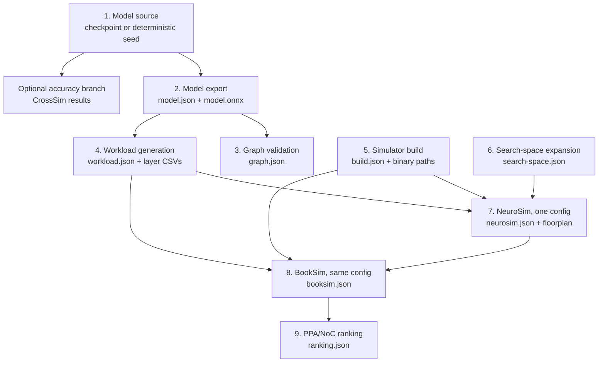
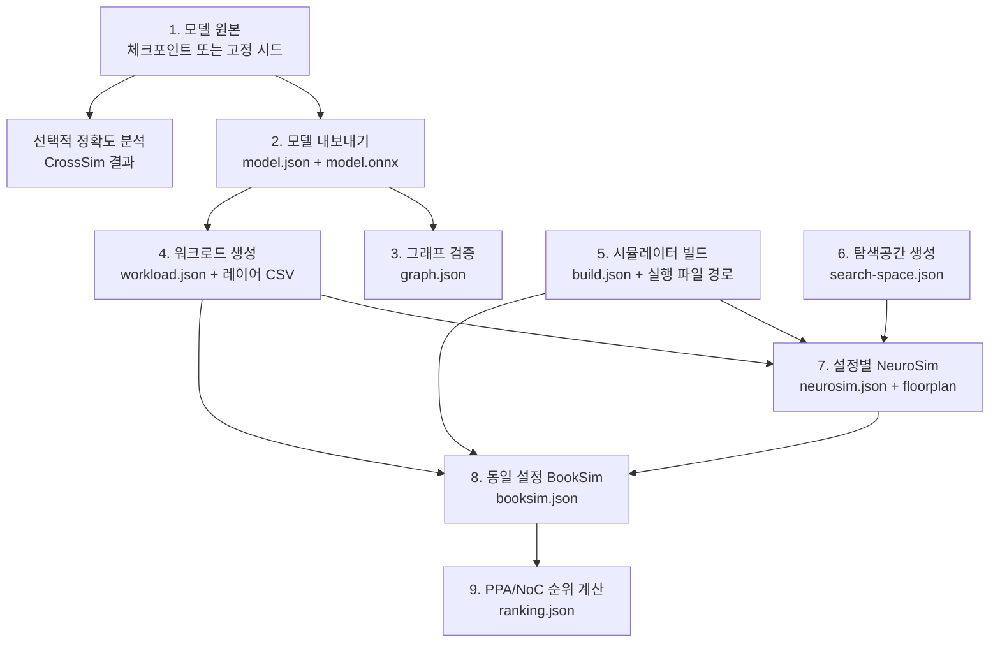

# NavCim Functional Pipeline

The maintained `navcim_m4` path is split into file-based stages. Every stage
accepts an explicit manifest, writes a new JSON manifest, and records
`performance.wall_seconds`. Simulator manifests also expose their native PPA or
NoC metrics, so one candidate and one stage can be profiled repeatedly without
rerunning earlier work.

## Ordered Flow



Graph validation and workload generation intentionally branch from the same
model manifest. Simulator building and search-space generation are also
independent and can run in parallel.

## Stage Contracts

| Order | Command | Explicit input | Explicit output | Independent measurements |
|---:|---|---|---|---|
| 1 | `export-model` | checkpoint or seed | `model.json`, `model.onnx` | export wall time, ONNX digest |
| 2 | `validate-graph` | `model.json` | `graph.json` | validation wall time, layer counts |
| 3 | `create-workload` | `model.json` | `workload.json`, CSV files | preprocessing wall time, layer count |
| 4 | `build-simulators` | repository root | `build.json`, binary paths | total build wall time |
| 5 | `create-search-space` | parameter lists | `search-space.json` | expansion time, candidate count |
| 6 | `run-neurosim` | workload, build, search space, one key | `neurosim.json`, log, floorplan | latency, energy, leakage, area, wall time |
| 7 | `run-booksim` | workload, build, one NeuroSim manifest | `booksim.json`, log | cycles, power, leakage, area, wall time |
| 8 | `crosssim` | checkpoint, dataset, analog config | `crosssim_results.json` | accuracy and inference times |
| 9 | `rank` | one or more `booksim.json` files | `ranking.json` | normalized score, ranking wall time |

## Reproducible Example

Run each line separately. A completed output is the next stage's input and can
be retained while editing or profiling only one implementation.

```bash
python -m navcim_m4.pipeline export-model \
  --output-dir outputs/pipeline/model

python -m navcim_m4.pipeline validate-graph \
  --model-manifest outputs/pipeline/model/model.json \
  --output outputs/pipeline/graph.json

python -m navcim_m4.pipeline create-workload \
  --model-manifest outputs/pipeline/model/model.json \
  --output-dir outputs/pipeline/workload

python -m navcim_m4.pipeline build-simulators \
  --output outputs/pipeline/build.json --jobs 8

python -m navcim_m4.pipeline create-search-space \
  --sa 128,256 --pe 4 --tile 8,16 --adc 5 --cell 2 --mux 8 \
  --output outputs/pipeline/search-space.json

python -m navcim_m4.pipeline run-neurosim \
  --workload-manifest outputs/pipeline/workload/workload.json \
  --build-manifest outputs/pipeline/build.json \
  --search-space-manifest outputs/pipeline/search-space.json \
  --config-key sa128x128_pe4_tile8_adc5_cell2_mux8 \
  --output-dir outputs/pipeline/candidates/sa128

python -m navcim_m4.pipeline run-booksim \
  --workload-manifest outputs/pipeline/workload/workload.json \
  --build-manifest outputs/pipeline/build.json \
  --neurosim-manifest outputs/pipeline/candidates/sa128/neurosim.json

python -m navcim_m4.pipeline rank \
  --candidate-manifest outputs/pipeline/candidates/sa128/booksim.json \
  --output outputs/pipeline/ranking.json
```

Repeat `run-neurosim` and `run-booksim` with another `config-key` and output
directory. Supply every resulting `booksim.json` by repeating
`--candidate-manifest` when ranking.

The existing `python -m navcim_m4 run` command remains available as the
all-in-one compatibility path. Training, CrossSim evaluation, CrossSim sweeps,
BookSim dataset collection, and predictor training already have standalone
input/output commands documented in `README.md`.

## Legacy Boundary

`Inference_pytorch` remains the original Ubuntu/CUDA research workflow for its
Python and shell entry points. The maintained ARM64 path intentionally reuses
and extends `Inference_pytorch/NeuroSIM` C++ for padding-aware workload
handling, explicit column muxing, and floorplan/NoC artifact output. The
independently runnable pipeline above is the supported ARM64 implementation.

---

# NavCim 기능별 파이프라인

현재 유지보수 대상인 `navcim_m4` 실행 경로는 파일 기반 단계로 분리되어
있습니다. 각 단계는 명시적인 manifest를 입력받아 새로운 JSON manifest를
출력하고 `performance.wall_seconds`에 실행시간을 기록합니다. 시뮬레이터
manifest에는 PPA 또는 NoC 지표도 포함되므로, 이전 단계를 다시 실행하지
않고 특정 후보의 특정 단계만 반복해서 분석할 수 있습니다.

## 실행 순서도



그래프 검증과 워크로드 생성은 동일한 모델 manifest에서 독립적으로
분기됩니다. 시뮬레이터 빌드와 탐색공간 생성도 서로 의존하지 않으므로
병렬로 실행할 수 있습니다.

## 단계별 입출력 계약

| 순서 | 명령 | 명시적 입력 | 명시적 출력 | 독립 측정 항목 |
|---:|---|---|---|---|
| 1 | `export-model` | 체크포인트 또는 시드 | `model.json`, `model.onnx` | 내보내기 시간, ONNX 해시 |
| 2 | `validate-graph` | `model.json` | `graph.json` | 검증 시간, 레이어 수 |
| 3 | `create-workload` | `model.json` | `workload.json`, CSV 파일 | 전처리 시간, 레이어 수 |
| 4 | `build-simulators` | 저장소 루트 | `build.json`, 실행 파일 경로 | 전체 빌드 시간 |
| 5 | `create-search-space` | 하드웨어 파라미터 목록 | `search-space.json` | 생성 시간, 후보 수 |
| 6 | `run-neurosim` | 워크로드, 빌드, 탐색공간, 설정 키 하나 | `neurosim.json`, 로그, floorplan | 지연시간, 에너지, 누설전력, 면적, 실행시간 |
| 7 | `run-booksim` | 워크로드, 빌드, NeuroSim manifest 하나 | `booksim.json`, 로그 | 사이클, 전력, 누설전력, 면적, 실행시간 |
| 8 | `crosssim` | 체크포인트, 데이터셋, 아날로그 설정 | `crosssim_results.json` | 정확도, 추론시간 |
| 9 | `rank` | 하나 이상의 `booksim.json` | `ranking.json` | 정규화 점수, 순위 계산시간 |

## 단계별 실행 예시

아래 명령은 한 줄씩 개별 실행할 수 있습니다. 완료된 단계의 출력이 다음
단계의 입력이 되므로, 특정 구현만 수정하거나 프로파일링할 때 이전 단계의
산출물을 그대로 재사용할 수 있습니다.

```bash
python -m navcim_m4.pipeline export-model \
  --output-dir outputs/pipeline/model

python -m navcim_m4.pipeline validate-graph \
  --model-manifest outputs/pipeline/model/model.json \
  --output outputs/pipeline/graph.json

python -m navcim_m4.pipeline create-workload \
  --model-manifest outputs/pipeline/model/model.json \
  --output-dir outputs/pipeline/workload

python -m navcim_m4.pipeline build-simulators \
  --output outputs/pipeline/build.json --jobs 8

python -m navcim_m4.pipeline create-search-space \
  --sa 128,256 --pe 4 --tile 8,16 --adc 5 --cell 2 --mux 8 \
  --output outputs/pipeline/search-space.json

python -m navcim_m4.pipeline run-neurosim \
  --workload-manifest outputs/pipeline/workload/workload.json \
  --build-manifest outputs/pipeline/build.json \
  --search-space-manifest outputs/pipeline/search-space.json \
  --config-key sa128x128_pe4_tile8_adc5_cell2_mux8 \
  --output-dir outputs/pipeline/candidates/sa128

python -m navcim_m4.pipeline run-booksim \
  --workload-manifest outputs/pipeline/workload/workload.json \
  --build-manifest outputs/pipeline/build.json \
  --neurosim-manifest outputs/pipeline/candidates/sa128/neurosim.json

python -m navcim_m4.pipeline rank \
  --candidate-manifest outputs/pipeline/candidates/sa128/booksim.json \
  --output outputs/pipeline/ranking.json
```

다른 하드웨어 설정은 새로운 `config-key`와 출력 디렉터리를 지정하여
`run-neurosim`과 `run-booksim`을 반복 실행하면 됩니다. 여러 후보를 함께
평가할 때는 `rank` 명령에 `--candidate-manifest`를 후보 수만큼 반복해서
전달합니다.

기존의 `python -m navcim_m4 run` 명령은 전체 단계를 한 번에 실행하는
호환 경로로 계속 사용할 수 있습니다. 학습, CrossSim 평가와 sweep,
BookSim 데이터셋 수집, 예측기 학습은 이미 독립된 입출력 명령으로
제공되며 자세한 사용법은 `README.md`에 있습니다.

## 레거시 코드 경계

`Inference_pytorch`의 Python/셸 진입점은 기존 Ubuntu/CUDA 연구 구현입니다.
변경 가능한 셸 스크립트, 작업 디렉터리의 전역 파일, 구형 TVM Relay 문자열
파싱 및 환경별 도구에 의존합니다. 단, 지원 대상 ARM64 경로는 padding,
column mux, floorplan/NoC 산출물을 위해 `Inference_pytorch/NeuroSIM` C++를
의도적으로 확장합니다. 위의 독립 실행 파이프라인이 지원 대상 ARM64
구현입니다.
